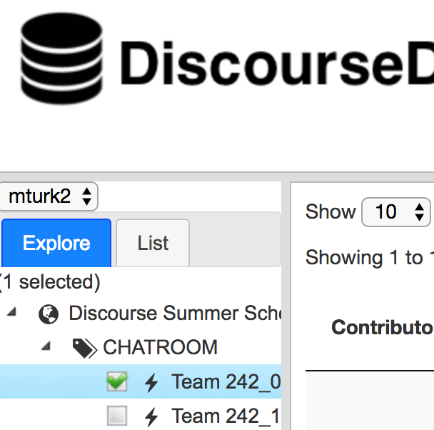
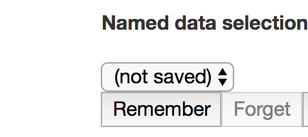
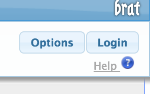

The [DiscourseDB data browser](https://erebor.lti.cs.cmu.edu/discoursedb/) allows you to 
browse the discussions that are part of any of the datasets you have been granted access to.
You can choose a dataset in the left panel and navigate through its structure (e.g. forums,
threads, discussion groups), and select multiple conversations you want to see.

To analyze these conversations it's often useful to work through a sample methodically and
mark them up to highlight interesting phenomena.  For example an education researcher might
mark instances of [transactive](https://www.ncbi.nlm.nih.gov/pmc/articles/PMC5405832/) 
responses to learn more about when students are responding constructively to each other in
an online course.

The high-level workflow for accomplishing this in DiscourseDB is as follows:

1. Choose a subset of the dataset you are interested in
2. Open that subset in Brat for annotation
3. Add annotations in the Brat tool 
  * Don't forget to log in!
  * No need to save your work!
4. Return to DiscourseDB, and explicitly re-import the Brat annotations

The steps in detail:

1. Choose a subset of the dataset you are interested in
  * Use the left panel to select a subset of the dataset that you are interested in annotating.
  * Click "Remember" in the top-center, and name this selection.  You can only annotate a named selection
  
  
  
2. Open that subset in Brat  
  * In the right panel, choose Annotate, and click the Annotate icon 
  * The Brat page will open in your browser.  The Brat tool 
requires a separate login at this time: click "login" in the upper right
corner, and use username 'discoursedb' and password 'discoursedb' 
  * Navigate through the hierarchy to conversations you are interested in
annotating.  Once you are in a conversation, you can move among them with the Next and Previous
links at the top of the page.

3. Add Annotations in the Brat tool
  * IMPORTANT: Select a substring of the <em>header</em> of a contribution
in order to label the whole contribution, as shown in the picture below.  Our current generation of
tools do not work with annotations of particular spans within a contribution, or selections spanning
multiple contributions. 
  * You are limited to the annotations supplied -- if you want a different label, please contact us.
A way to choose your own set of labels is coming soon.

4. Return to DiscourseDB and explicitly re-import the Brat annotations
  * When you are done, just close the Brat window -- your annotations are saved as you go.
  * If the database and subset you've been examining are not selected, select them
  * Open the Annotate pane in the right panel, and click "import" 
